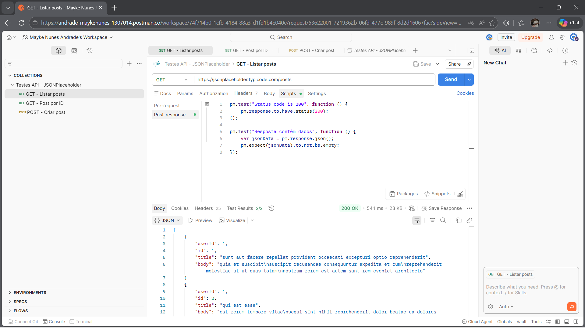
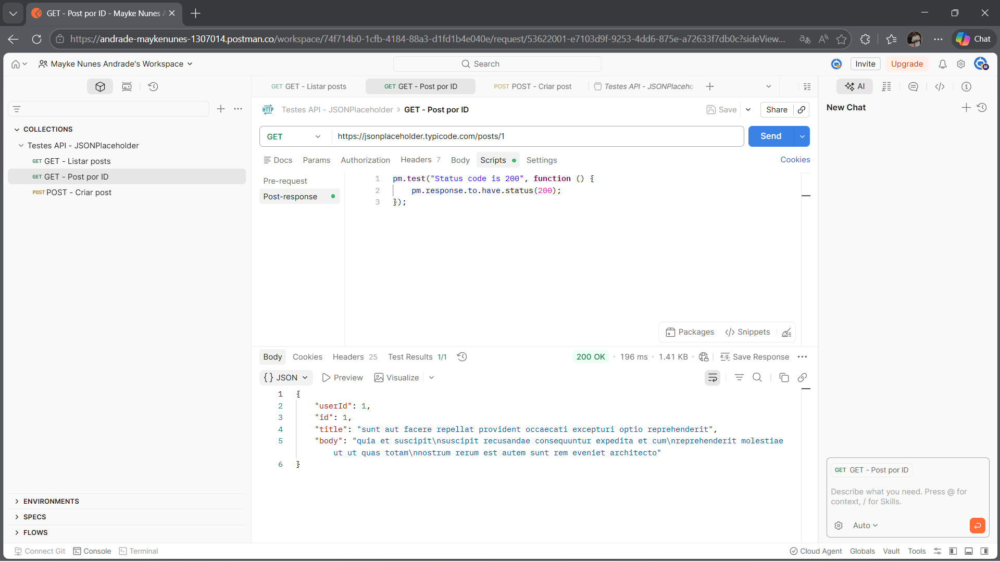
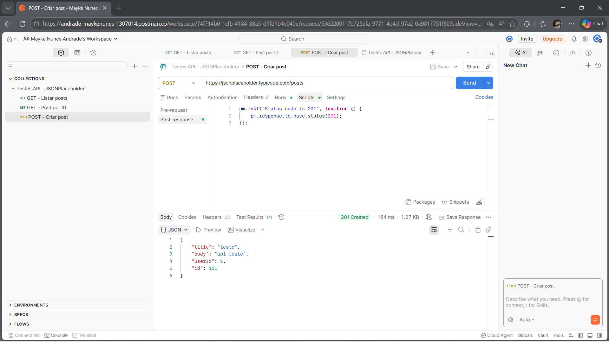

# 🌐 Testes de API com Postman

## 📌 Objetivo

Realizar testes de API utilizando o Postman, validando requisições HTTP, status de resposta e dados retornados.

## 🔧 Ferramenta

* Postman

## 🌐 API utilizada

https://jsonplaceholder.typicode.com/

## 🧪 Testes realizados

### ✅ GET /posts

* Status 200
* Retorno de lista com dados

### ✅ GET /posts/1

* Status 200
* Retorno de post específico

### ✅ POST /posts

* Status 201
* Criação de novo post

---

## 📸 Evidências

### 🔹 GET - Listar posts

### 🔹 GET - Post por ID

### 🔹 POST - Criar post

---

## 📂 Arquivos

* Collection exportada do Postman (.json)
