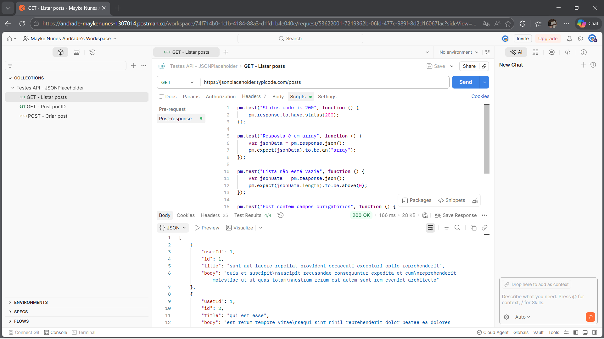
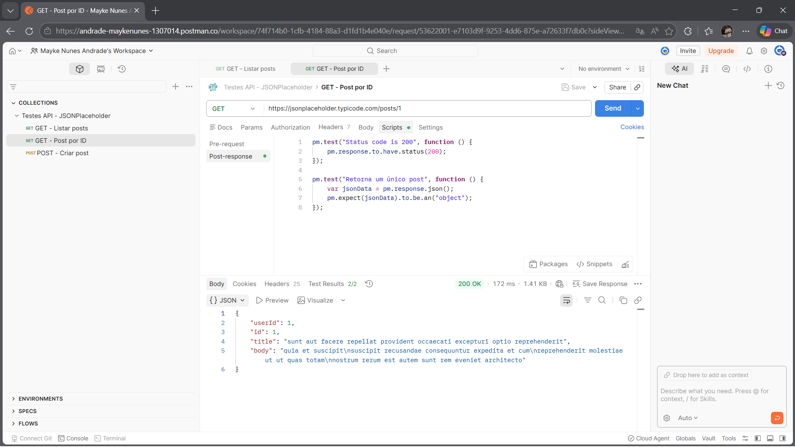
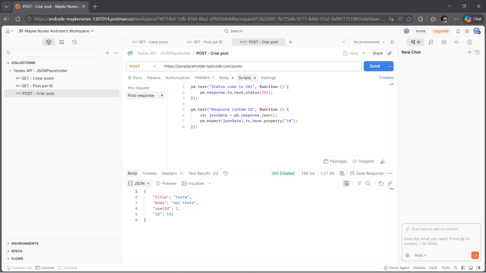

# 🌐 Testes de API com Postman

## 📌 Sobre o projeto

Este projeto tem como objetivo realizar testes de API utilizando o Postman, validando requisições HTTP, status de resposta e estrutura dos dados retornados.

## 🔧 Ferramentas utilizadas

* Postman

## 🌐 API utilizada

https://jsonplaceholder.typicode.com/

## 🧪 Testes realizados

### ✅ GET /posts

* Validação de status 200
* Retorno em formato array
* Lista não vazia
* Validação de campos (id, title, body)

### ✅ GET /posts/1

* Validação de status 200
* Retorno de objeto único

### ✅ POST /posts

* Validação de status 201
* Criação de novo post
* Retorno com ID

---

## 📸 Evidências

### 🔹 GET - Listar posts

### 🔹 GET - Post por ID

### 🔹 POST - Criar post

---

## 📂 Arquivos

* Collection exportada do Postman (.json)
