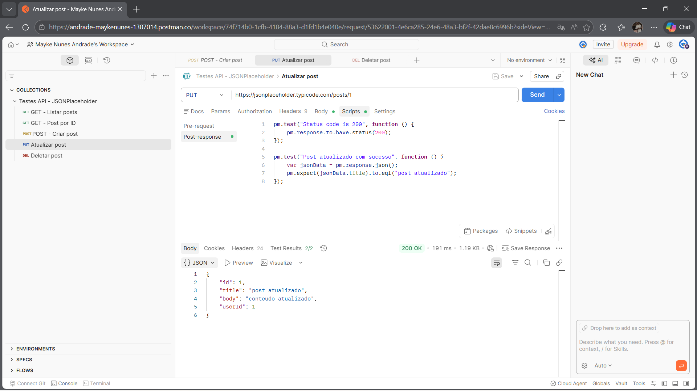
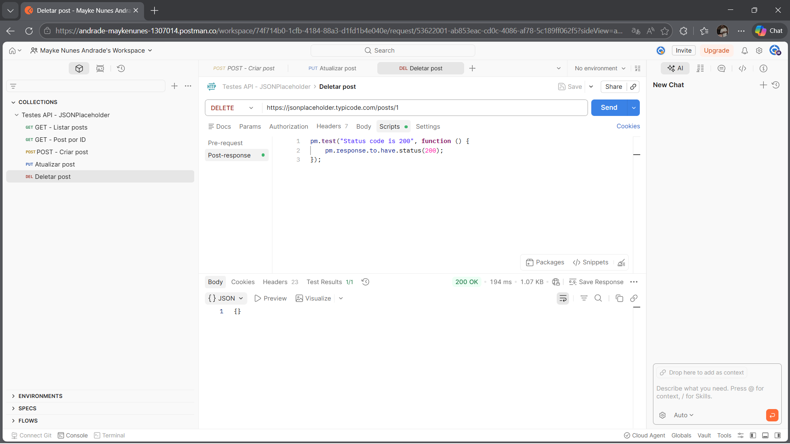

# 🌐 Testes de API com Postman

Projeto desenvolvido para validar requisições HTTP utilizando o Postman, aplicando testes automatizados em uma API REST pública.

O objetivo é demonstrar conhecimentos em testes de API, validação de respostas e boas práticas de qualidade de software (QA).

---

## 🔧 Ferramentas utilizadas

* Postman

---

## 🌐 API utilizada

https://jsonplaceholder.typicode.com/

---

## 🧪 Testes realizados

### ✅ GET /posts

* Validação de status code 200
* Verificação de retorno em formato array
* Lista não vazia
* Validação de campos obrigatórios (id, title, body)

### ✅ GET /posts/1

* Validação de status code 200
* Retorno de objeto único

### ✅ POST /posts

* Validação de status code 201
* Criação de novo post
* Retorno com ID

### ✅ PUT /posts/1

* Validação de status code 200
* Atualização de dados do post

### ✅ DELETE /posts/1

* Validação de status code 200
* Remoção de post

---

## 🧠 Estratégia de Testes

Os testes foram estruturados para validar:

* Status das requisições HTTP
* Estrutura dos dados retornados (JSON)
* Integridade das respostas da API
* Comportamento esperado dos endpoints (CRUD)

---

## 📸 Evidências

### 🔹 GET - Listar posts


### 🔹 GET - Post por ID


### 🔹 POST - Criar post


### 🔹 PUT - Atualizar post



### 🔹 DELETE - Deletar post



---

## 📂 Estrutura do projeto

```
testes-api-postman/
├── evidencias/
│   ├── get-posts.png
│   ├── get-post-id.png
│   ├── post-create.png
│   ├── put-update.png
│   ├── delete-post.png
├── Testes-API-Postman.json
└── README.md
```

---

## 📌 Como executar

1. Importar a collection no Postman
2. Executar as requisições disponíveis
3. Verificar os testes automatizados na aba "Tests"
4. Conferir as evidências disponíveis no projeto

---

## 🚀 Sobre mim

Cursando Tecnólogo em Análise e Desenvolvimento de Sistemas (ADS), com foco em Quality Assurance (QA) e testes de software.

Buscando oportunidade de estágio ou posição júnior na área de Tecnologia da Informação.
